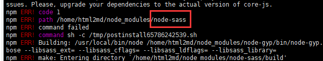
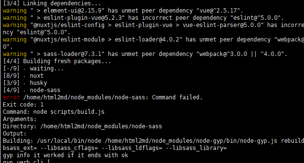

# html 转 md

> 本文主要介绍一款 非常好用的 html转md 工具，并提供线下部署地址。

[项目地址](<https://www.helloworld.net/html2md>)
[fork项目地址](<https://github.com/JKjenken/html2md>)

原项目安装部署文档不详细，如启动报错可参照如下配置进行调试。

# 在线部署 & 运行

``` shell
npm install
or
yarn install
```

若出现 node-sass报错时，是由于node版本错误，可以参考以下配置，采用 nvm或者n 修改node版本为14

[error /node_modules/node-sass: Command failed](<https://stackoverflow.com/questions/60394291/error-node-modules-node-sass-command-failed>)



``` shell
npm run dev
or
yarn dev

后台运行可以修改命令为
nohup yarn dev &

kill进程可以使用
 ps -ef | grep yarn 
 找到相关进程，执行 kill -9 xxx
 
 相关进程：node /usr/local/bin/yarn dev
 
 或者 在控制台输入sudo lsof -i:端口号，查看被占用进程的pid，再输入sudo kill -9 pid

```

package-lock.json文件规定了运行所需的版本，前期install时不能贸然删除，否则可能因为组件版本问题导致install过程报错，例如nuxt版本异常。

nuxt.config.js 文件可以配置服务器ip和端口

```javascript
server: {
    port: 3030, // default: 3000
    host: 'localhost' // default: localhost，可配置为服务器公网、局域网ip供外部访问
}
```

一些启动异常排查：


检查该组件版本
npm view @babel/preset-env version

若发现版本号和package-lock.json 文件不符，则需要手动修复版本，执行如下命令（执行报错时可以先移除package-lock.json文件 确保不出现版本冲突）
```shell
# 👇 remove node_modules and package-lock.json
rm -rf node_modules package-lock.json

# 👇 Clear and verify npm cache
npm cache clean --force
npm cache verify

npm install @babel/preset-env@7.11.0
npm install @babel/plugin-proposal-private-methods@7.12.13

```

保存后的md文件有可能会出现图片盗链情况，可以直接粘贴到csdn的markdown编辑器然后点击保存即可。

[CSDN markdown编辑器](<https://editor.csdn.net/md>)


